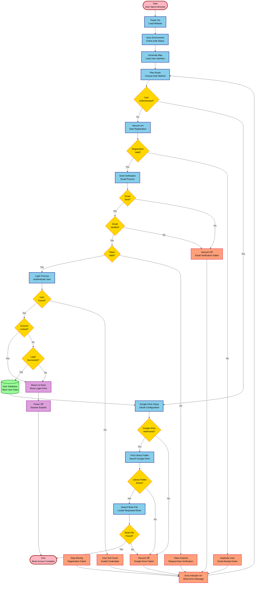

# AndyLibrary User Process Flowchart

## Visual Process Flow Diagram

## Legend

| Shape                 | Type         | Purpose                             | Example                          |
| --------------------- | ------------ | ----------------------------------- | -------------------------------- |
| ?�� **Oval**          | Start/End    | Entry and exit points               | Start, End                       |
| ?�� **Rectangle**     | Process      | Actions and operations              | Load Website, Send Email         |
| ?�� **Diamond**       | Decision     | Yes/No choice points                | User Authenticated?, Email Sent? |
| ?�� **Cylinder**      | Storage      | Data storage                        | User Database                    |
| ?�� **Parallelogram** | Error/Action | Error states and corrective actions | Show Error, Return to Login      |

## Process Flow Explanation

### **1. Initialization Phase**

- **Start**: User opens browser
- **Power On**: Website loads
- **Scan Environment**: Check if user is already authenticated
- **Generate Map**: Load appropriate user interface
- **Plan Route**: Present authentication options

### **2. Authentication Decision**

- **Diamond Check**: Is user already authenticated?
  - **Yes**: Skip to Google Drive setup
  - **No**: Begin registration process

### **3. Registration Process**

- **Vacuum On**: Start registration form
- **Validation Check**: Is registration data valid?
  - **Yes**: Send verification email
  - **No**: Show error and return to planning

### **4. Email Verification**

- **Send Email**: Attempt email delivery
- **Email Sent Check**: Was email successfully sent?
  - **Yes**: Check if user verifies email
  - **No**: Show email error

### **5. Login Security**

- **Battery Check**: Is account locked due to failed attempts?
  - **Yes**: Return to login dock (show lockout message)
  - **No**: Process login attempt

### **6. Google Drive Integration**

- **Route Database**: Store user session data
- **Google Drive Setup**: Initialize OAuth process
- **Authorization Check**: Did user grant Google Drive access?
  - **Yes**: Search for library folder
  - **No**: Show Drive setup error

### **7. Book Access**

- **Find Folder**: Look for "AndyLibrary" folder
- **Folder Exists**: Is the folder present?
  - **Yes**: Search for specific book file
  - **No**: Show folder creation instructions

### **8. Final Delivery**

- **File Found**: Is the requested book available?
  - **Yes**: Complete success - deliver book
  - **No**: Show file upload instructions

This diagram maps directly to the AndyLibrary user journey while using the same visual conventions as your reference image, with different shapes representing different types of processes and decision points.